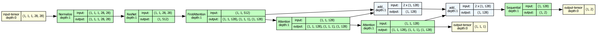
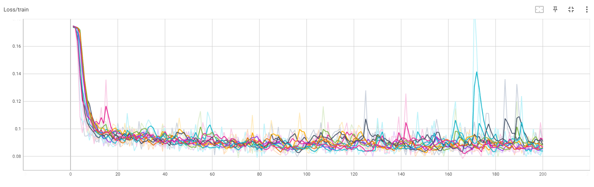
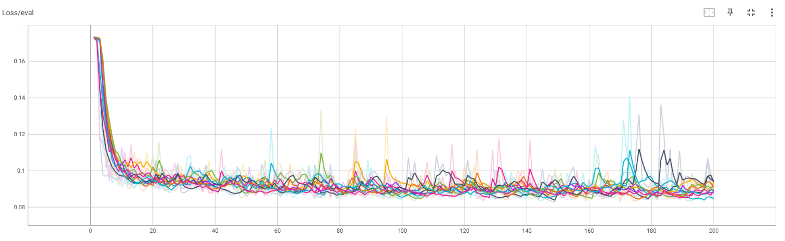
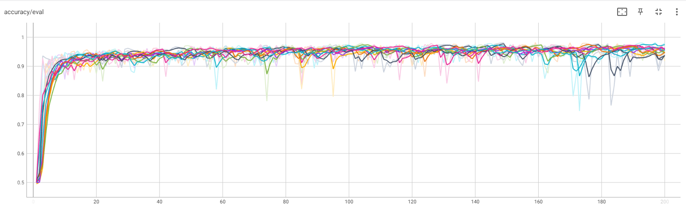

# Summary
## Problem statement
In this research, we proposed method, which can be used to preparing model solving Weakly-supervised classification problem using 
Multi-Scale Attention-based Multiple Instance Learning based on [arXiv:2209.03041](https://arxiv.org/abs/2209.03041).

The trained model should classify bags with and without number `7`.
Notably, an application of the Multi-Scale Attention-based approach provides insight into the contribution of each instance to the bag label. 

## Data
In this specific case each training, validating and testing bag consists of on average `10` images with standard deviation of `2`, but no less
than `5` and no more than `250000000`. Label of bag is positive (`1`) if there is at least one `7` in a data point and zero (`0`) otherwise.

Moreover images are normalized with `mean=0.1307` and `std=0.3081`. Normalization is part of the model definition.

## Model structure
The proposed approach uses resnet18 as a feature extractor. Input images dimension was changed to `1`. 
Then three Attention blocks computes attentions and images features weighted by attentions.
The final fc layer returns values (Softmax) for each class: positive and negative.

|    |
|:-----------------------------:|
|       Fig1. Model graph       |

### Attention function 
An attention layer in aggregation layer is defined as a weighted sum:

$$z=\sum_{k=1}^K a_k x_k $$

where

$$ a_k = \frac{e^{w^\mathfrak{T} \tanh(Vx_k^\mathfrak{T})}}{\sum_{j=1}^K e^{w^\mathfrak{T} \tanh(Vx_j^{T})}} $$

## Learning process
All experiments were conducted on workstation with Intel(R) Core(TM) i7-10750H CPU (2.60GHz), 32 GB RAM and single GPU NVIDAIA Quadro T1000 (4 GB).

At the beginning of each training epoch new set of training bags are created. This prevents overwriting of the model and speeds up learning.
The model are trained with learning rate of `5e-05`, weight_decay of `10e-5` and with Adam optimization algorithm.

From each learning process only one model is saved (after an epoch with best `validation_accuracy`).

10 models with the following parameters have been trained:
* epochs: `200`
* training_bags: `200` (for epoch * `200` epochs = `40 000` different bags)
* validation_bags: `1 000`

The learning process of one model took about 33 minutes.

|  |
|:--------------------------:|
|    Fig2. Learning loss     |

|    |
|:---------------------------:|
|    Fig3. Evaluation loss    |

|     |
|:---------------------------:|
|  Fig4. Evaluation accuracy  |

## Metrics for Testing
Each model were tested on testing sets of `10 000` bags based on testing MNIST Dataset. Used metrics:
* `presicion = tp / (tp + fp)`
* `recall = tp / (tp + fn)`
* `accuracy = (presicion + recall) / 2` - testing data is balanced, `5 000` positive and negative bags
* `F1 = 2 * (prec * rec) / (prec + rec)` - testing data is balanced

## Results
| Model       |   precision |   recall |   accuracy |     F1 |
|-------------|-------------|----------|------------|--------|
| 0           |      0.9777 |   0.9554 |     0.9665 | 0.9664 |
| 1           |      0.9778 |   0.9616 |     0.9697 | 0.9696 |
| 2           |      0.9691 |   0.9486 |     0.9589 | 0.9588 |
| 3           |      0.9777 |   0.9474 |     0.9626 | 0.9623 |
| 4           |      0.991  |   0.9256 |     0.9583 | 0.9572 |
| 5           |      0.9906 |   0.9498 |     0.9702 | 0.9698 |
| 6           |      0.9762 |   0.9588 |     0.9675 | 0.9674 |
| 7           |      0.9738 |   0.9584 |     0.9661 | 0.966  |
| 8           |      0.9743 |   0.9632 |     0.9688 | 0.9687 |
| 9           |      0.985  |   0.9458 |     0.9654 | 0.965  |
| **average** |      0.9793 |   0.9515 |     0.9654 | 0.9651 |
| **std**     |      0.0072 |   0.011  |     0.0042 | 0.0044 |

All models obtained high metric values (`~98% precision` and `~95% recall`) and standard deviation is low.

The model with highest `F1` value (model `5`) were tested on second testing dataset (`5 000` positive and negative bags).

|   Model |   precision |   recall |   accuracy |     F1 |
|---------|-------------|----------|------------|--------|
|       5 |      0.9907 |   0.9562 |     0.9734 | 0.9731 |

The average time of model evaluation on single bag is `6ms` and maximum time is `32ms`. 
